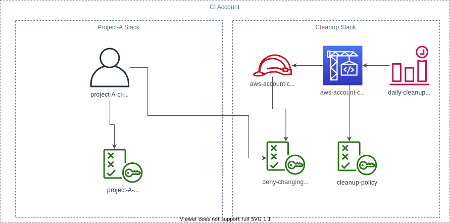

# AWS CI Account Setup

[](https://github.com/exasol/ci-isolation-aws/actions/workflows/ci-build.yml)
[](https://search.maven.org/artifact/com.exasol/ci-isolation-aws)

[](https://sonarcloud.io/dashboard?id=com.exasol%3Aci-isolation-aws)

[](https://sonarcloud.io/dashboard?id=com.exasol%3Aci-isolation-aws)
[](https://sonarcloud.io/dashboard?id=com.exasol%3Aci-isolation-aws)
[](https://sonarcloud.io/dashboard?id=com.exasol%3Aci-isolation-aws)
[](https://sonarcloud.io/dashboard?id=com.exasol%3Aci-isolation-aws)

[](https://sonarcloud.io/dashboard?id=com.exasol%3Aci-isolation-aws)
[](https://sonarcloud.io/dashboard?id=com.exasol%3Aci-isolation-aws)
[](https://sonarcloud.io/dashboard?id=com.exasol%3Aci-isolation-aws)
[](https://sonarcloud.io/dashboard?id=com.exasol%3Aci-isolation-aws)

This repository contains a setup for provisioning an AWS sub-account for CI testing.

[Features](doc/features.md)



As shown in the picture the repository consists of two parts: The cleanup-stack and the ci-user-stack. The cleanup-stack is only required once per account. The ci-user-stack for each project that you want to test.

## Usage

First deploy the ci-user-stack from this repository:

```shell
cdk --profile <AWS-PROFILE> deploy --parameters exaOwner=<YOUR E-MAIL>
```

### Adding a CI-User for a new Project

Now you can add a ci user for the project you want to test:

* In the project repository create a new CDK stack:

    ```
    cdk init app --language=Java
    ```
* Now remove the autogenerated Stack.
* Add this project as maven dependency.
* Add a policy document to the resources of the CDK project (see next section)
* In the App add:
    ```
    final CiUserStack stack = new CiUserStack(app, CiUserStack.CiUserStackProps.builder().projectName("<YOUR PROJECT_NAME>")
                    .addRequiredPermissions(new PolicyReader().readPolicyFromResources("<YOUR POLICY DOCUMENT>")).build());
    ```
* deploy the stack

## Update Minimal Permissions

In order to keep the impact of a hacking attack low, we want to only grant the required permissions to the CI user. In this section we describe an approach for detecting the required permissions of cour CI-build.

Determining the minimal set of permissions by hand is quite a lot of work. To make our lives easier we use the tool [iamlive](https://github.com/iann0036/iamlive). This tool spies on the local AWS CLI and terraform and reports the used permissions. These permissions are not complete in case Terraform uses CloudFormation under the hood, but it's a lot better than having nothing.

To extract the minimal permissions do the following steps:

* Set your AWS credential environment variables for a user set has lots of permissions on AWS (usually using `. aws_get_session_token`).
* Run iamlive:

  ```shell
  ./iamlive --set-ini --mode proxy --force-wildcard-resource
  ```
* In another terminal run:

  ```shell
  export HTTP_PROXY=http: // 127.0.0.1:10080 #(REMOVE THE BANKS; They are just there so that the link checker does not complain)
  export HTTPS_PROXY=http: // 127.0.0.1:10080
  ```
* Run everything your CI runs in the 2nd terminal. Typically:
    * Create infrastructure (e.g. using Terraform)
    * Run tests
    * Destroy infrastructure
* Copy the last output from iamlive in the first terminal to into [`src/main/resources/minnimal-permissions.json`](src/main/resources/minnimal-permissions.json).

### Exasol Cloud Formation Template

The Exasol database is usually created using a Cloud Formation template. The steps from this template are not recorded by iamlive since the CloudFormation template is evaluated in the cloud and by that, the request don't pass the proxy.

So we have to find out the required permissions by hand. Luckily Exasol offers a [policy for running an Exasol cluster](https://s3.eu-central-1.amazonaws.com/cloudtools.exasol.com/iam_policy.json). We simply downloaded this one and added it as resource. In the future it might be required to update this resource.

## Additional Tasks for Setting up a CI Account

* Visit https://aws.amazon.com/marketplace/pp?sku=ctqmztsepbuk7e9f2ks9nlwj1 and accept license (subscribe)
* Configure account alias
    * Open AWS Console
    * Go to `IAM` / `Dashboard`
    * On the top of the page edit the alias

## Testing

This repository contains an integration tests (`PermissionBoundaryIT`) that the CI user only has the expected privileges.

In order to use this test you need an AWS user with admin privileges. For that reason we do not run this the in the CI. To run it locally create a file named `test_config.yaml` in this directory:

```yaml
owner: <your e-mail; used as exa:owner tag>
profile: <the aws-profile for the admin user>
```

Before running the tests, deploy the stack using the CDK.

## Additional Information

* [Dependencies](dependencies.md)
* [Changelog](doc/changes/changelog.md)
